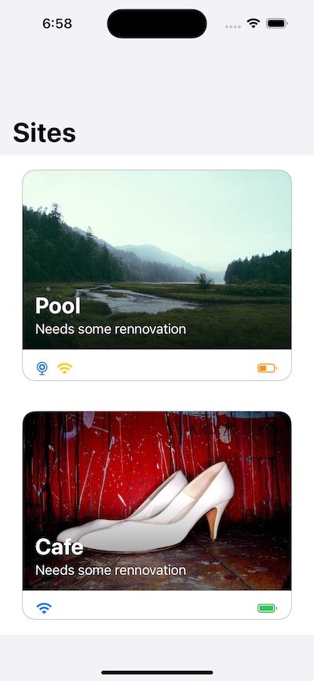
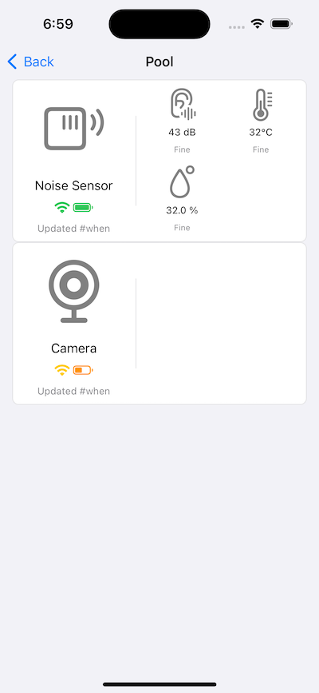

# Site Watch - Demo iOS App

Site Watch is a virtual site security monitor app lets you browse virtual 
sites and monitor imagenary sensors measurements such as temperature, noise 
level, smoke detection, and humidity as well route connecitivy and batter 
levels.

To run the demo without a server setup, the app fetches sites and monitors
real time sensor measurements events from a simulated server running in-app.

The first screen is written in SwiftUI and put into a UIHostingController for
view controller based navigation. See [`struct SitesViewController.swift`](SiteWatch/SitesScene/SitesViewController.swift) for code.



The second screen, on the other hande, is written in UIKit with UICollectionViewController.



The [MVVM-Navigator Scene pattern](https://github.com/simonkim/lorenpicsumapp) is applied to this app project for clear boundaries of responsibilities, smooth dependency provision from one layer to another, as well as smooth navigation between two view controllers


# No server to run!
While the server side is under development and the APIs are not yet available, we can start app development already. Until clear definition of the APIs are available, it is not a bad idea to let the app depend on an abstract protocol interface, that we were going to do it anyway!

```swift
// Abstract interface that our ViewModels depend on
protocol RemoteServer {
    func fetchSites() async throws -> [Site]
    func eventPublisher() -> AnyPublisher<SiteEvent, Never>
}

protocol SiteEvent {
    var timestamp: Date { get }
}

// Simulated implementation of the server
class SimulatedServer: RemoteServer {
    var eventSubject = PassthroughSubject<SiteEvent, Never>()
    
    /// Fake models pretend JSON decoded objects over the network
    func fetchSites() async throws -> [Site] {
        return Site.stubSamples     
    }
    
    /// Simulation loop sends out virtual events via this Combine publisher
    func eventPublisher() -> AnyPublisher<SiteEvent, Never> {
        return eventSubject
            .eraseToAnyPublisher()
    }
}

```

# MVVM-Navigator Pattern

This [`struct SitesScene`](SiteWatch/SitesScene/SitesScene.swift) demonstrates how each responsibility is defined, reconnected, and what are dependencies to be provided from the upper layer.

```swift
struct SitesScene {
    // Dependencies
    let remoteServer: RemoteServer
    let imageStore: CachedImageStore
    let logger: AppLogger
    
    func viewController() -> UIViewController {
        // Navigator
        let navigationController = UINavigationController()
        let navigator = SitesNavigatorImpl(
            dependency: .init(
                logger: logger,
                remoteEvents: remoteServer.eventPublisher(),
                navigationController: navigationController
            )
        )
        // ViewModel
        let viewModel = SiteViewModelImpl(
            remoteServer: remoteServer,
            imageStore: imageStore,
            logger: logger,
            navigator: navigator
        )
        // View Controller
        let view = SitesView(
            viewModel: viewModel
        )
        
        let viewController = UIHostingController(rootView: view)
        navigationController.pushViewController(viewController, animated: false)
        
        return navigationController
    }
}
```

# Work in progress

Some job opening asks for FireBase proficiency for analytics, remote notification, events and many. Further work on this demo app project will introduce adaptation layers so the code
doesn't directly depend on these 3rd party APIs so we can replace it with minimum effort. For example, FirBase backed apps can't run in China and we may want to plug a different solution for the same purpose. That's where this adaptation layers come in handy.

Unit test cases were a high priority from the beginning of this project. However, the plan had to quickly change to a prototype project so this project can be made available for my interviewers 🤪

Model, ViewModel, ViewController, and Navigator are clearly separated and reconnected under MVVM-Navigator pattern, Unit test cases will soon begin to be written ...

- Cheers


